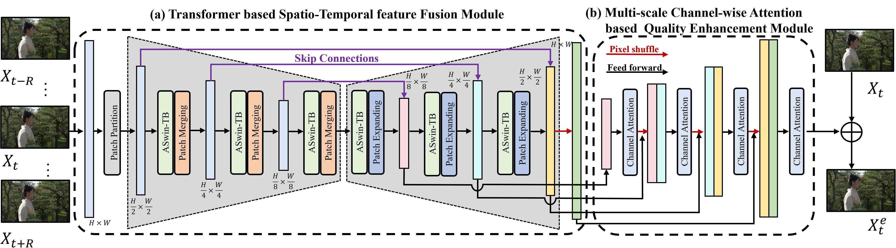
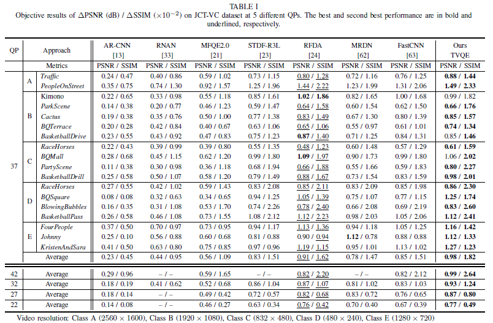
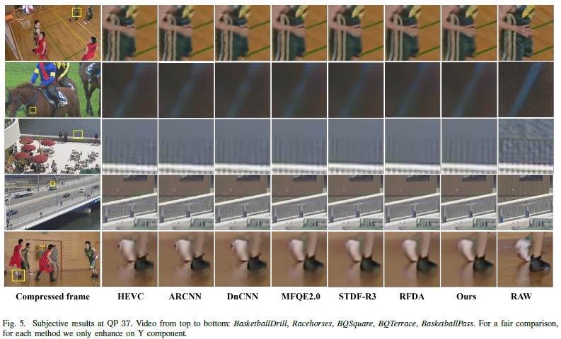

## End-to-end Transformer for Compressed Video Quality Enhancement

### Abstract

Convolutional neural networks have achieved excellent results in compressed video quality enhancement task in recent years. State-of-the-art methods explore the spatiotemporal information of adjacent frames mainly by deformable convolution. However, the CNN-based methods can only exploit local information, thus lacking the exploration of global information. Moreover, current methods enhance the video quality at a single scale, ignoring the multi-scale information, which corresponds to information at different receptive fields and is crucial for correlation modeling. Therefore, in this work, we propose a Transformer-based compressed video quality enhancement (TVQE) method, consisting of Transformer based Spatio-Temporal feature Fusion (TSTF) module and Multi-scale Channel-wise Attention based Quality Enhancement (MCQE) module. The proposed TSTF module learns both local and global features for correlation modeling, in which window-based Transformer and the encoder-decoder structure greatly improve the execution efficiency. The proposed MCQE module calculates the multi-scale channel attention, which aggregates the temporal information between channels in the feature map at multiple scales, achieving efficient fusion of inter-frame information. Extensive experiments on the JCT-VT test sequences show that the proposed method increases PSNR by up to 0.98 dB when QP=37. Meanwhile, the inference speed is improved by up to 9.4%, and the number of Flops is reduced by up to 84.4% compared to competing methods at 720p resolution. Moreover, the proposed method achieves the BD-rate reduction up to 23.04%.

### Network Architecture

The framework of our proposed TVQE method, which consists of the Transformer based Spatio-Temporal feature Fusion (TSTF) Module and the Multi-scale Channel-wise Attention based Quality Enhancement (MCQE) Module. The TSTF module is designed to exploit spatio-temporal correlation between multiple frames. After TSTF, the multi-scale information between channels in the feature map is further fused by the MCQE module, and finally generate the enhanced frame.

### Results

**Please check our paper for detail results.**

### Citation

@article{yu2022end,
 title={End-to-end Transformer for Compressed Video Quality Enhancement},
 author={Yu, Li and Chang, Wenshuai and Wu, Shiyu and Gabbouj, Moncef},
 journal={arXiv preprint arXiv:2210.13827},
 year={2022}
 organization={IEEE}
}